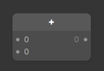
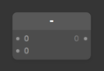
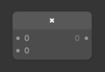
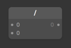
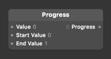
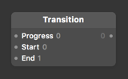
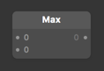
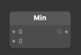
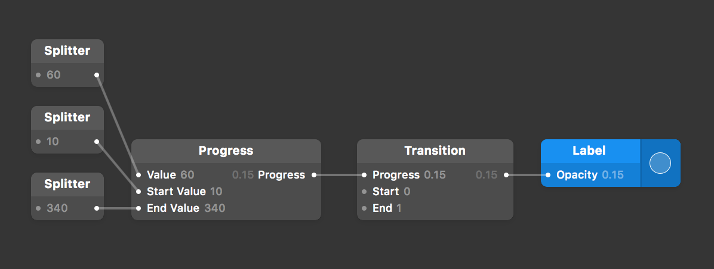

# RxOrigami

[](https://github.com/Carthage/Carthage)

Operator set for interactive animation. Inspired by [Origami Studio](http://origami.design/)

## Operators

### Add



### Substruct



### Multiply



### Devide



### Progress



### Transition



### Max



### Min




## Example



```swift
let label = UILabel()
let start = Variable<CGFloat>(10)
let end = Variable<CGFloat>(340)
let value = Variable<CGFloat>(18)

value.asObservable()
  .progress(
    start: start.asObservable(),
    end: end.asObservable()
  )
  .transition(start: 0, end: 1)
  .bindNext { alpha in
    label.alpha = alpha
}
```

# License

RxOrigami is available under the MIT license. See the LICENSE file for more info.
